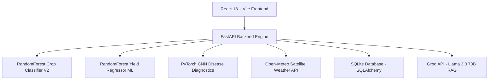

# 🌾 KrishiAstra — India-Wide AI Smart Agriculture Platform

**KrishiAstra** is a production-ready, modern AI Smart Agriculture platform built for farmers across all 28 States and 8 Union Territories of India. It combines Machine Learning crop recommendation & yield forecasting, Computer Vision leaf disease diagnosis, Time Series APMC market price predictions, live satellite weather telemetry, a farmer community hub with AI summary synthesis, and a multilingual RAG AI Assistant powered by **Llama 3.3 70B Versatile through Groq API**.

---

## 🌟 Key Upgraded Features

### 🌾 1. Smart India-Wide Crop Recommendation
* **India-Wide Location Coverage:** Supports all 28 States, 8 Union Territories, districts, cities/towns, and instant GPS geocoding lookup.
* **Agro-Climatic Multi-Parametric Evaluation:** Considers soil type, Nitrogen (N), Phosphorus (P), Potassium (K), pH, rainfall, temperature, humidity, location, and cropping season.
* **Seasonal Adaptability:** Fully supports **Kharif (Monsoon)**, **Rabi (Winter)**, and **Zaid (Summer)** seasons.
* **Top 3–5 Ranked Crop Suitability Cards:** Displays suitability match scores, growth duration (days), water requirements, expected yield (tonnes/ha), yield range, and tailored agronomic advice.

### 📈 2. ML Crop Yield & Production Prediction
* **Dedicated Regression Pipeline:** Uses a trained `RandomForestRegressor` model evaluating crop, location, season, soil, rainfall, temperature, NPK nutrients, and farm acreage.
* **Evaluation Metrics:**
  * **R² Score (Accuracy):** `0.981`
  * **Mean Absolute Error (MAE):** `1.431 tonnes/ha`
  * **Root Mean Squared Error (RMSE):** `2.932 tonnes/ha`
  * **Dataset Size:** `1,200 statistical agricultural training benchmarks`
* **Output:** Predicted yield (tonnes/hectare), total expected harvest production (tonnes), realistic lower/upper ranges, model performance metrics display, and agronomic optimization advice.

### 📍 3. India Agricultural Intelligence Map
* **Regional Land & Crop Profile:** Interactive map interface allowing farmers to select any Indian state and district.
* **Displays:** Primary soil composition, Kharif/Rabi/Zaid suitable crop breakdowns, average annual rainfall, current weather, and APMC market commodities.

### 👥 4. Farmer Community Hub & AI Knowledge Synthesis
* **Peer Learning Network:** Farmers can create discussion posts, specify crop categories and locations, upload crop leaf photos, upvote helpful tips, and report inappropriate content.
* **AI Community Summarizer:** Automatically analyzes active community posts and presents a dual breakdown clearly separating **Verified ICAR/APMC Agricultural Facts** from **Farmer Community Opinions**.

### 🤖 5. Multilingual RAG AI Assistant (Llama 3.3 70B via Groq)
* **Groq Llama 3.3 70B Versatile Integration:** Retains pre-trained Llama 3.3 accessed via Groq API.
* **Full Context Awareness:** Chatbot processes comprehensive farmer state: `location + district + crop + soil + season + weather + yield + community`.
* **Multi-Lingual Support:** Supports **Kannada (ಕನ್ನಡ), Hindi (हिंदी), and English** (including Kanglish & Hinglish) with automatic same-language response generation and voice microphone dictation.

### 🎨 6. Premium UI/UX Aesthetics & Visual Backgrounds
* **Unique Hero Background Images:** Every major page features a distinct agricultural background image with high-contrast text overlays and dark glassmorphism cards (`backdrop-blur-xl`):
  * 🏠 **Dashboard:** Indian farmland sunrise
  * 🌾 **Crop Recommendation:** Vibrant green field crops
  * 📈 **Yield Prediction:** Golden harvest fields
  * 🌿 **Disease Detection:** Close-up leaf inspection
  * 📍 **India Map:** Indian agricultural landscape
  * 🌦️ **Weather:** Dynamic sky and field sensors
  * 👥 **Community:** Farmers meeting in lush field
  * 🏪 **APMC Market:** Indian mandi produce
  * 📊 **Price Forecast:** Market trend trajectory
  * 🏛️ **Govt Schemes:** Farm land under blue sky
  * 🤖 **AI Chatbot:** Farmer using smart technology

---

## 🛠️ Architecture & Technology Stack



* **Frontend:** React + TypeScript + Vite + Tailwind CSS + Recharts + Lucide Icons
* **Backend:** Python + FastAPI + Uvicorn + SQLAlchemy (SQLite database)
* **Machine Learning:** Scikit-Learn (RandomForest Classifier & Regressor) + PyTorch (CNN) + OpenCV (`cv2`) + Pandas + NumPy
* **AI & RAG:** Groq API (`llama-3.3-70b-versatile`) + Agricultural RAG Knowledge Base

---

## 🚀 Installation & Setup

### Prerequisites
* Python 3.10+
* Node.js 18+ & npm

### 1. Backend Setup
```bash
cd backend
python -m venv venv

# Windows PowerShell:
.\venv\Scripts\Activate.ps1

pip install -r requirements.txt
python main.py
```
*Backend runs at:* `http://127.0.0.1:8000` (Swagger docs at `http://127.0.0.1:8000/docs`).

### 2. Frontend Setup
```bash
cd frontend
npm install
npm run build
npm run dev
```
*Frontend runs at:* `http://localhost:3000`

---

## 🔑 Environment Configuration (`.env`)

```env
PORT=8000
DATABASE_URL=sqlite:///./krishiastra.db
GROQ_API_KEY=your_groq_api_key_here
PINECONE_API_KEY=your_pinecone_api_key_here
```
> **Note:** When API keys are omitted, KrishiAstra gracefully runs its built-in multi-lingual fallback engine.

---

## 📡 Key API Endpoints Reference

| Method | Endpoint | Description |
| :--- | :--- | :--- |
| `GET` | `/api/location/states-districts` | Returns all 28 States, 8 UTs, and districts across India |
| `POST` | `/api/location/gps` | Geocodes latitude & longitude to nearest district |
| `POST` | `/api/recommend-crop-v2` | Location & season-aware crop recommendation engine |
| `POST` | `/api/predict-yield` | ML yield (tonnes/ha) & total production predictor |
| `GET` | `/api/india-agri-map` | Regional soil profile, Kharif/Rabi/Zaid crop breakdown |
| `POST` | `/api/detect-disease` | PyTorch CNN leaf disease vision diagnosis |
| `POST` | `/api/predict-price` | APMC market price forecasting module |
| `GET` | `/api/weather` | Open-Meteo live weather telemetry & alerts |
| `POST` | `/api/calculate-irrigation` | Root-zone smart irrigation calculator |
| `GET` | `/api/community/posts` | Lists community posts with location & crop filters |
| `POST` | `/api/community/posts` | Creates new farmer community post |
| `GET` | `/api/community/ai-summary` | AI Community Knowledge Synthesis (Facts vs Opinions) |
| `POST` | `/api/chat` | Groq Llama 3.3 70B RAG chatbot |

---

## 📜 License & Acknowledgements
Built for Indian Farmers as part of the **KrishiAstra Smart Agriculture Initiative**. Open Source & Free to use.
